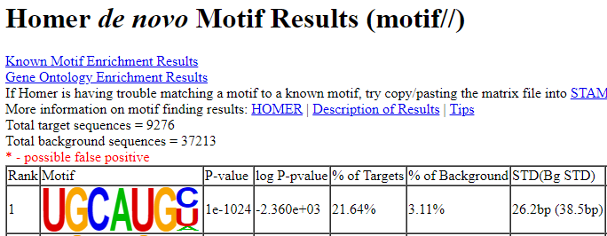

# CLIP-seq Analysis of Multi-mapped reads

<a id='section0'></a>
## Table of Content
1. [Introduction](#section1)
2. [Installation](#section2)
3. [Input](#section3)
4. [Usage](#section4)<br>
    4.1 [preprocessor](#section41)<br>
    4.2 [realigner](#section42)<br>
    4.3 [peakcaller](#section43)<br>
    4.4 [permutation_callpeak](#section44)<br>
    4.5 [peak_annotator](#section45)<br>
    4.6 [data_downloader](#section46)<br>
5. [Output](#section5)
6. [An example](#section6)<br>
    6.1 [Sample dataset](#section61)<br>
    6.2 [Preprossing of sample dataset](#section62)<br>
    6.3 [Read mapping](#section63)<br>
    6.4 [PCR duplicate removal](#section64)<br>
    6.5 [CLAM pre-processing](#section65)<br>
    6.6 [Realigning](#section66)<br>
    6.7 [Peak calling](#section67)<br>
    6.8 [Annotation](#section68)<br>
    6.9 [Detecting motif](#section69)

<a id='section1'></a>
## Introduction
CLAM is a general toolkit for re-aligning multi-mapped reads in CLIP/RIP-seq data and calling peaks.
For details, please read our [NAR paper](https://academic.oup.com/nar/article/45/16/9260/4077049).
Recently, we updated CLAM to version v1.2.0 with new features:
1. Implemented new strandness tagging for anti-sense reads.
2. Multi-replicate mode for peak calling and benchmarking.
3. Annotating peaks to genomic region annotations.
4. Install through pypi.

[TOC](#section0)

<a id='section2'></a>
## Installation
CLAM v1.2 works under Python 2/3. Please click and download the latest version from the releases. Once unzip the file, type


```
python setup.py install
```

in your terminal and this will automatically install CLAM in your currently working python.

You should have already installed "pysam" using pip/conda for your python interpreter. If not, you can check the detailed requirements in the file "requirements.txt", or type


```
pip install -r requirements.txt
```

to install those requirements manually.

Or, a simpler way to install CLAM is through Pypi:


```
pip install --index-url https://test.pypi.org/simple/ --no-deps CLAM
```

[TOC](#section0)

<a id='section3'></a>
## Input
The input for CLAM is a sorted or unsorted BAM file of CLIP-seq alignment and a gene annotation file in GTF format.<br>
In the case of RIP-seq or eCLIP, a BAM file for IP experiment and a BAM file for Control/input experiment are taken together as input.<br><br>
Note: As in the released version v1.1, the read_gtf function had a bug and required the Gencode format GTF (i.e. last column of GTF matches gene_id "(xx)" ) to proceed the peak calling. This bug has been fixed in the github repository and has been fixed in later releases/patches.


[TOC](#section0)

<a id='section4'></a>
## Usage
CLAM is run through issueing subcommands. Currently there are four subcommands available: preprocessor, realigner, peakcaller permutation_callpeak and peak_annotator.


```
usage: CLAM [-h] [--version]
            {preprocessor,realigner,peakcaller,permutation_callpeak,peak_annotator,data_downloader}
            ...

CLAM -- CLip-seq Analysis of Multi-mapped reads

positional arguments:
  {preprocessor,realigner,peakcaller,permutation_callpeak,peak_annotator,data_downloader}
    preprocessor        CLAM Preprocessor: tag read alignments to specific
                        locus
    realigner           CLAM Realigner: realign multi-mapped reads using
                        expectation-maximization
    peakcaller          CLAM Peakcaller: negative binomial model-based peak
                        calling combining unique- and multi-reads
    permutation_callpeak
                        CLAM permutation peakcaller: call peaks using
                        permutation (as in v1.0.0)
    peak_annotator      CLAM peak annotator: assign peaks to genomic regions
    data_downloader     CLAM data downloader: download data of genomic regions

optional arguments:
  -h, --help            show this help message and exit
  --version             show program's version number and exit

For command line options of each sub-command, type: CLAM COMMAND -h
```

[TOC](#section0)

<a id='section41'></a>
### CLAM preprocessor
This subcommand (new since v1.1) will prepare the input files for CLAM pipeline. It looks for reads passing QC, splits the input bam file by sorting them into `unique.sorted.bam` and `multi.sorted.bam`, and adding an additional tag "RT" (short for Read Tag) to each alignment based which read tagger function the user supplied.

Note that you can also run `CLAM realigner` directly, which will call `preprocessor` and automatically determine if `preprocessor` has been called in the output folder.

Parameters:

--read-tagger-method will tag a CLIP/RIP read to a particular locus; 'median' tags read center and is recommended for RIP-seq; 'start' tags read start site and is recommended for CLIP-seq.

--max-tags N will collapse reads mapped to the identical locations up to N reads. This is usually used for RIP-seq with strong PCR duplication issues.

If you don't want to run `realigner`, you can also run peakcaller directly after preprocessor.

Example run:


```
CLAM preprocessor -i path/to/input/Aligned.out.bam -o path/to/clam/outdir/ --read-tagger-method median
```

[TOC](#section0)

<a id='section42'></a>
### CLAM realigner
This subcommand will run expectation-maxmization to assign the multi-mapped reads in a probablistic framework. 
More details about the EM model is described in our NAR paper.

Parameters:
--read-tagger-method will tag a CLIP/RIP read to a particular locus; 'median' tags read center and is recommended for RIP-seq; 'start' tags read start site and is recommended for CLIP-seq.
--max-tags N will collapse reads mapped to the identical locations up to N reads. This is usually used for RIP-seq with strong PCR duplication issues.

Note when `--retag` is specified, `realigner` will re-run `preprocessor` regardless; otherwise, it will use 
the prepared files in `outdir` if available.

Example run:


```
CLAM realigner -i path/to/input/Aligned.out.bam -o path/to/clam/outdir/ --read-tagger-method start --retag
```

[TOC](#section0)


<a id='section43'></a>
### CLAM peakcaller
This subcommand (new since v1.1) will call peaks by looking for bins enriched with IP reads over control, specifying a 
Negative-binomial model on observed read counts.

Note we can specify both `unique.sorted.bam` (from `preprocessor`) and `realigned.sorted.bam` (from `realigner`) and 
separte the two file paths by a space, to call peaks using the combination of uniquely- and multi-mapped reads.

Alternatively, we can also only input `unique.sorted.bam`; this will allow CLAM to call peaks using only uniquely-
mapped reads.

As a new feature in version 1.2.0, we implemented multi-replicate mode for peakcaller. Simply use comma to seperate bam files of replicates (Here, we assume there are two replicates named rep1 and rep2).

Example run:


```
CLAM peakcaller -i path/to/IP/rep1/unique.sorted.bam,path/to/IP/rep2/unique.sorted.bam \
path/to/IP/rep1/realigned.sorted.bam,path/to/IP/rep2/realigned.sorted.bam \
-c path/to/CTRL/unique.sorted.bam path/to/CTRL/realigned.sorted.bam \
-o path/to/peaks/outdir --unstranded --binsize 100 \
--gtf path/to/gencode.v19.annotation.gtf
```

[TOC](#section0)

<a id='section44'></a>
### CLAM permutation_callpeak
This subcommand will call peaks using permutation by randomly placing reads along the gene.
More details about the permutation procedure is described in our NAR paper.

Example run:


```
CLAM permutation_callpeak -i path/to/outdir/unique.sorted.bam path/to/outdir/realigned.sorted.bam \
-o path/to/peaks/outdir -p 8 \
--gtf path/to/gencode.v19.annotation.gtf
```

[TOC](#section0)

<a id='section45'></a>
### CLAM peak_annotator
This sumcommand will annotate peaks to genomic regions. It requires genomic region files to exist. If not, `peak_annotator` will call `data_downloader` automatically. Currently, we support annotation of human(version hg19 and hg38) and mouse(version mm10)

Example run:


```
CLAM peak_annotator path/to/peak/file/narrow_peak.unique.bed hg19 path/to/output/annotate.txt
```

[TOC](#section0)

<a id='section46'></a>
### CLAM data_downloader
This sumcommand will download prepared genomic annotation files to local system. Usually, it was called by `peak_annotator` automatically. You can also run it manually.

Example run:


```
CLAM data_downloader hg19
```

[TOC](#section0)

<a id='section5'></a>
## Output

The output of the re-aligner is "realigned.sorted.bam" (previously "assigned_multimapped_reads.bam" in v1.0), 
which is a customized BAM file following SAM format. 
Note that the re-aligned weights are stored in "AS:" tag, so please be aware and do not change/omit it.
Output of re-aligner could also be seen as an intermediate file for CLAM pipeline.

The output of the peak-caller is a bed file following NarrowPeak format. It is a 10-column [BED](https://genome.ucsc.edu/FAQ/FAQformat.html#format1) format file. 

If you run permutation peak caller (as in v1.0), there will be only one output file called "narrow_peak.permutation.bed".
Hence a peak with "combined" but no "unique" on the fifth column indicates this is a rescued peak; both "unique" and 
"combined" as common peak; or lost peak otherwise.

If you run model-based peak caller (since v1.1), depending on the specified paramter (whether you turned on `--unique-only`), 
the output will be either "narrow_peak.unique.bed" for peaks called using only uniquely-mapped reads; or 
"narrow_peak.combined.bed" for peaks called when adding realigned multi-mapped reads.

The output of peak-annotator is a BED file with extra columns output by BEDTools intersect command ([-wa](https://bedtools.readthedocs.io/en/latest/content/tools/intersect.html#wa-reporting-the-original-a-feature), [-wb](https://bedtools.readthedocs.io/en/latest/content/tools/intersect.html#wb-reporting-the-original-b-feature), [-bed](https://bedtools.readthedocs.io/en/latest/content/tools/intersect.html#bed-output-bed-format-when-using-bam-input) ). A more detailed description can be found [here](#section6_8)

[TOC](#section0)

<a id='section6'></a>
## An example

<a id='section61'></a>
### Sample dataset


A typical application of CLAM is to call peaks with CLIP-seq data. Here, we take an eCLIP seq dataset as an example. (A full Snakemake pipeline for analysing eCLIP data can be found [here](https://github.com/zj-zhang/CLAM_ENCODE_Snakemake).)

In this demo, we focused on RBFOX2 eCLIP data from K562 cell line provided by Van <em>et. al.</em> 


```
Van Nostrand, E. L., G. A. Pratt, A. A. Shishkin, C. Gelboin-Burkhart, M. Y. Fang, B. Sundararaman, S. M. Blue, T. B. Nguyen, C. Surka, K. Elkins, R. Stanton, F. Rigo, M. Guttman and G. W. Yeo (2016). "Robust transcriptome-wide discovery of RNA-binding protein binding sites with enhanced CLIP (eCLIP)." Nat Methods 13(6): 508-514.
```

First, download raw data from ENCODE：


```
wget https://www.encodeproject.org/files/ENCFF495WQA/@@download/ENCFF495WQA.fastq.gz
wget https://www.encodeproject.org/files/ENCFF492QZU/@@download/ENCFF492QZU.fastq.gz
wget https://www.encodeproject.org/files/ENCFF930TLO/@@download/ENCFF930TLO.fastq.gz
wget https://www.encodeproject.org/files/ENCFF462CMF/@@download/ENCFF462CMF.fastq.gz
wget https://www.encodeproject.org/files/ENCFF163QEA/@@download/ENCFF163QEA.fastq.gz
wget https://www.encodeproject.org/files/ENCFF942TPA/@@download/ENCFF942TPA.fastq.gz
```

A detaild list for each file:

<body link="#0563C1" vlink="#954F72">

<table border="0" cellpadding="0" cellspacing="0" width="664" style="border-collapse:
 collapse;table-layout:fixed;width:499pt">
 <colgroup><col class="xl66" width="99" style="mso-width-source:userset;mso-width-alt:3444;
 width:74pt">
 <col width="64" span="2" style="width:48pt">
 <col width="130" style="mso-width-source:userset;mso-width-alt:4538;width:98pt">
 <col width="64" style="width:48pt">
 <col width="109" style="mso-width-source:userset;mso-width-alt:3816;width:82pt">
 <col width="134" style="mso-width-source:userset;mso-width-alt:4677;width:101pt">
 </colgroup><tbody><tr height="19" style="height:14.5pt">
  <td height="19" class="xl66" width="99" style="height:14.5pt;width:74pt">File Name</td>
  <td class="xl65" width="64" style="width:48pt">Cell Line</td>
  <td class="xl65" width="64" style="width:48pt">Bait</td>
  <td class="xl65" width="130" style="width:98pt">Group</td>
  <td class="xl65" width="64" style="width:48pt">Run type</td>
  <td class="xl65" width="109" style="width:82pt">Encode Accession</td>
  <td class="xl65" width="134" style="width:101pt">Platform</td>
 </tr>
 <tr height="19" style="height:14.5pt">
  <td height="19" class="xl66" style="height:14.5pt">ENCFF495WQA</td>
  <td class="xl65">K562</td>
  <td class="xl65">RBFOX2</td>
  <td class="xl65">Control-Read 1</td>
  <td class="xl65">PE55nt</td>
  <td class="xl65">ENCSR051IXX</td>
  <td class="xl65">Illumina HiSeq 4000</td>
 </tr>
 <tr height="19" style="height:14.5pt">
  <td height="19" class="xl66" style="height:14.5pt">ENCFF492QZU</td>
  <td class="xl65">K562</td>
  <td class="xl65">RBFOX2</td>
  <td class="xl65">Control-Read 2</td>
  <td class="xl65">PE46nt</td>
  <td class="xl65">ENCSR051IXX</td>
  <td class="xl65">Illumina HiSeq 4000</td>
 </tr>
 <tr height="19" style="height:14.5pt">
  <td height="19" class="xl66" style="height:14.5pt">ENCFF930TLO</td>
  <td class="xl65">K562</td>
  <td class="xl65">RBFOX2</td>
  <td class="xl65">Replicate 1-Read 1</td>
  <td class="xl65">PE45nt</td>
  <td class="xl65">ENCSR756CKJ</td>
  <td class="xl65">Illumina HiSeq 4000</td>
 </tr>
 <tr height="19" style="height:14.5pt">
  <td height="19" class="xl66" style="height:14.5pt">ENCFF462CMF</td>
  <td class="xl65">K562</td>
  <td class="xl65">RBFOX2</td>
  <td class="xl65">Replicate 1-Read 2</td>
  <td class="xl65">PE46nt</td>
  <td class="xl65">ENCSR756CKJ</td>
  <td class="xl65">Illumina HiSeq 4000</td>
 </tr>
 <tr height="19" style="height:14.5pt">
  <td height="19" class="xl66" style="height:14.5pt">ENCFF163QEA</td>
  <td class="xl65">K562</td>
  <td class="xl65">RBFOX2</td>
  <td class="xl65">Replicate 2-Read 1</td>
  <td class="xl65">PE45nt</td>
  <td class="xl65">ENCSR756CKJ</td>
  <td class="xl65">Illumina HiSeq 4000</td>
 </tr>
 <tr height="19" style="height:14.5pt">
  <td height="19" class="xl66" style="height:14.5pt">ENCFF942TPA</td>
  <td class="xl65">K562</td>
  <td class="xl65">RBFOX2</td>
  <td class="xl65">Replicate 2-Read 2</td>
  <td class="xl65">PE46nt</td>
  <td class="xl65">ENCSR756CKJ</td>
  <td class="xl65">Illumina HiSeq 4000</td>
 </tr>
 <!--[if supportMisalignedColumns]-->
 <tr height="0" style="display:none">
  <td width="99" style="width:74pt"></td>
  <td width="64" style="width:48pt"></td>
  <td width="64" style="width:48pt"></td>
  <td width="130" style="width:98pt"></td>
  <td width="64" style="width:48pt"></td>
  <td width="109" style="width:82pt"></td>
  <td width="134" style="width:101pt"></td>
 </tr>
 <!--[endif]-->
</tbody></table>


</body>

[TOC](#section0)

<a id='section62'></a>
### Preprossing of sample dataset

When all raw reads were downloaded, use catadaptor to remove adaptor sequences. Before this, let's unzip all files and rename them:


```
ll | grep fastq | awk '{print $9}' | xargs gzip -d
mv ENCFF495WQA.fastq K562_RBFOX2_Inp_R1.fastq
mv ENCFF492QZU.fastq K562_RBFOX2_Inp_R2.fastq
mv ENCFF930TLO.fastq K562_RBFOX2_rep1_IP_R1.fastq
mv ENCFF462CMF.fastq K562_RBFOX2_rep1_IP_R2.fastq
mv ENCFF163QEA.fastq K562_RBFOX2_rep2_IP_R1.fastq
mv ENCFF942TPA.fastq K562_RBFOX2_rep2_IP_R2.fastq
```

To remove adaptors, each paired-end reads should go through 2 rounds of processing. Take control as an example:


```
cutadapt -f fastq --match-read-wildcards --times 1 -e 0.1 -O 1 --quality-cutoff 6 -m 18 \
-a NNNNNAGATCGGAAGAGCACACGTCTGAACTCCAGTCAC -g CTTCCGATCTACAAGTT -g CTTCCGATCTTGGTCCT \
-A AACTTGTAGATCGGA -A AGGACCAAGATCGGA -A ACTTGTAGATCGGAA -A GGACCAAGATCGGAA \
-A CTTGTAGATCGGAAG -A GACCAAGATCGGAAG -A TTGTAGATCGGAAGA -A ACCAAGATCGGAAGA \
-A TGTAGATCGGAAGAG -A CCAAGATCGGAAGAG -A GTAGATCGGAAGAGC -A CAAGATCGGAAGAGC \
-A TAGATCGGAAGAGCG -A AAGATCGGAAGAGCG -A AGATCGGAAGAGCGT -A GATCGGAAGAGCGTC \
-A ATCGGAAGAGCGTCG -A TCGGAAGAGCGTCGT -A CGGAAGAGCGTCGTG -A GGAAGAGCGTCGTGT \
-o K562_RBFOX2_Inp_R1.adapterTrim.fastq -p K562_RBFOX2_Inp_R2.adapterTrim.fastq \
K562_RBFOX2_Inp_R1.fastq K562_RBFOX2_Inp_R2.fastq
```


```
cutadapt -f fastq --match-read-wildcards --times 1 -e 0.1 -O 5 --quality-cutoff 6 -m 18 \
-A AACTTGTAGATCGGA -A AGGACCAAGATCGGA \
-A ACTTGTAGATCGGAA -A GGACCAAGATCGGAA -A CTTGTAGATCGGAAG -A GACCAAGATCGGAAG \
-A TTGTAGATCGGAAGA -A ACCAAGATCGGAAGA -A TGTAGATCGGAAGAG \
-A CCAAGATCGGAAGAG -A GTAGATCGGAAGAGC -A CAAGATCGGAAGAGC -A TAGATCGGAAGAGCG \
-A AAGATCGGAAGAGCG -A AGATCGGAAGAGCGT -A GATCGGAAGAGCGTC \
-A ATCGGAAGAGCGTCG -A TCGGAAGAGCGTCGT -A CGGAAGAGCGTCGTG -A GGAAGAGCGTCGTGT \
-o K562_RBFOX2_Inp_R1.adapterTrim.round2.fastq -p K562_RBFOX2_Inp_R2.adapterTrim.round2.fastq \
K562_RBFOX2_Inp_R1.adapterTrim.fastq K562_RBFOX2_Inp_R2.adapterTrim.fastq
```

[TOC](#section0)

<a id='section63'></a>
### Read mapping

After reads were processed, we will need to map reads to genome. Here, we use STAR to map reads to human genome, version GRCh37.75. For a more comprehensive introduction to STAR, click [here](https://github.com/alexdobin/STAR).<br>
Still, we take Control as an example:


```
STAR --genomeDir /full/path/to/STAR/index/folder \
--readFilesIn K562_RBFOX2_Inp_R1.adapterTrim.round2.fastq K562_RBFOX2_Inp_R2.adapterTrim.round2.fastq 
--outSAMtype BAM Unsorted \
--outFileNamePrefix ../star/K562_RBFOX2_Inp/ \
--alignEndsProtrude 15 ConcordantPair \
--outFilterMultimapNmax 100 \
--runThreadN 20 \
--outStd Log
```

[TOC](#section0)

<a id='section64'></a>
### PCR duplicate removal

As rRNAs and other repetitive RNA  may cause bias when performing peak calling, we will need to clean the mapped reads.<br> Use [BEDTOOLS](https://bedtools.readthedocs.io/en/latest/) to remove rRNAs (Optional. rRNA annotation can be exported from [UCSC Table Browser](http://genome.ucsc.edu/cgi-bin/hgTables)).


```
bedtools intersect -f 0.90 -abam ../star/K562_RBFOX2_Inp/Aligned.out.bam -b /path/to/rRNA/annotation.bed -v > ../star/K562_RBFOX2_Inp/Aligned.out.mask_rRNA.bam
```


```
bedtools intersect -f 0.90 -abam ../star/K562_RBFOX2_rep1_IP/Aligned.out.bam -b /path/to/rRNA/annotation.bed -v > ../star/K562_RBFOX2_rep1_IP/Aligned.out.mask_rRNA.bam
```


```
bedtools intersect -f 0.90 -abam ../star/K562_RBFOX2_rep2_IP/Aligned.out.bam -b /path/to/rRNA/annotation.bed -v > ../star/K562_RBFOX2_rep2_IP/Aligned.out.mask_rRNA.bam
```

In CLIP data analysis, its important to remove PCR duplicates. Here we used our in-house code to remove PCR duplicates (The code can be found [here](https://raw.githubusercontent.com/zj-zhang/CLAM_ENCODE_Snakemake/master/scripts/collapse_pcr/collapse_duplicates.py)). Them -m option indicates output log file of removed read number of each adaptor.


```
python2 collapse_duplicates.py -b star/K562_RBFOX2_Inp/Aligned.out.mask_rRNA.bam -o star/K562_RBFOX2_Inp/Aligned.out.mask_rRNA.dup_removed.bam -m star/K562_RBFOX2_Inp/dup_removal.metrics.txt
```


```
python2 collapse_duplicates.py -b star/K562_RBFOX2_rep1_IP/Aligned.out.mask_rRNA.bam -o star/K562_RBFOX2_rep1_IP/Aligned.out.mask_rRNA.dup_removed.bam -m star/K562_RBFOX2_rep1_IP/dup_removal.metrics.txt
```


```
python2 collapse_duplicates.py -b star/K562_RBFOX2_rep2_IP/Aligned.out.mask_rRNA.bam -o star/K562_RBFOX2_rep2_IP/Aligned.out.mask_rRNA.dup_removed.bam -m star/K562_RBFOX2_rep2_IP/dup_removal.metrics.txt
```

[TOC](#section0)

<a id='section65'></a>
### CLAM preprocessing

As one of the major feature of CLAM, multi-mapped reads were rescued by an EM procedure while peak calling (See our [paper](https://academic.oup.com/nar/article/45/16/9260/4077049) for more detail). Before peak calling, CLAM will seperate multi-mapped reads and uniquely mapped reads. This process can be omiited, if so, CLAM will still call the preprocessing module if it cannot find seperated BAM files.


```
CLAM preprocessor -i star/K562_RBFOX2_Inp/Aligned.out.mask_rRNA.dup_removed.bam -o clam/K562_RBFOX2_Inp --read-tagger-method start
```


```
CLAM preprocessor -i star/K562_RBFOX2_rep1_IP/Aligned.out.mask_rRNA.dup_removed.bam -o clam/K562_RBFOX2_rep1_IP --read-tagger-method start
```


```
CLAM preprocessor -i star/K562_RBFOX2_rep2_IP/Aligned.out.mask_rRNA.dup_removed.bam -o clam/K562_RBFOX2_rep2_IP --read-tagger-method start
```

[TOC](#section0)

<a id='section66'></a>
### Realigning

This step will realign multi-mapped reads to each putative genome location with a probability. CLAM realigner uses uniquely mapped reads to determine the probability weight of mutli-mapped reads for each genome locus. 


```
CLAM realigner -i clam/K562_RBFOX2_Inp/ -o clam/K562_RBFOX2_Inp --winsize 50 --max-tags -1 --read-tagger-method start
```


```
CLAM realigner -i clam/K562_RBFOX2_rep1_IP/ -o clam/K562_RBFOX2_rep1_IP --winsize 50 --max-tags -1 --read-tagger-method start
```


```
CLAM realigner -i clam/K562_RBFOX2_rep2_IP/ -o clam/K562_RBFOX2_rep2_IP --winsize 50 --max-tags -1 --read-tagger-method start
```

[TOC](#section0)

<a id='section67'></a>
### Peak calling

This step will call peaks in multi-replicate mode of CLAM.


```
CLAM peakcaller -i clam/K562_RBFOX2_rep1_IP/unique.sorted.bam,clam/K562_RBFOX2_rep2_IP/unique.sorted.bam \
clam/K562_RBFOX2_rep1_IP/realigned.sorted.bam,clam/K562_RBFOX2_rep2_IP/realigned.sorted.bam \
-c clam/K562_RBFOX2_Inp/unique.sorted.bam clam/K562_RBFOX2_Inp/realigned.sorted.bam \
-o clam/peaks --unstranded --binsize 100 \
--gtf path/to/gencode.v19.annotation.gtf
```

[TOC](#section0)

<a id='section68'></a>
### Annotation

Once peaks were called, the genome regions of peaks can be annotated by `peak_annotator`. If genomic region annotation file location is not in system environment or CLAM cannot find the files of the specific genome version in dedicated location, it will call data_downloder automatically.


```
CLAM peak_annotator -i clam/peaks/narrow_peak.combined.bed -g hg19 -o clam/peaks/annotate.txt
```

The header of result file will looks like:


```
## Annotation peaks to genomic regions all intersected genomic regions are presented.
## CLAM version: 1.2.0
## Column 1:  Peak chromosome
## Column 2:  Peak start
## Column 3:  Peak end
## Column 4:  Peak name
## Column 5:  Peak score
## Column 6:  Peak strand
## Column 7:  Peak signal value
## Column 8:  Peak pValue
## Column 9:  Peak qValue
## Column 10: Point-source called for this peak
## Column 11: Genomic region chromosome
## Column 12: Genomic region start
## Column 13: Genomic region end
## Column 14: Gene ID
## Column 15: Quality score
## Column 16: Genomic region strand
## Column 17: Genomic region type
```

[TOC](#section0)

<a id='section69'></a>
### Detecting motif

If you have [HOMER](http://homer.ucsd.edu/homer/motif/) installed, try to detect over-represented motifs using it.


```
findMotifsGenome.pl clam/peaks/narrow_peak.combined.bed hg19 motif/ -rna -len 5,6,7 -p 20 -size 100 -S 10
```

Ideally, you will get a list of motifs, including a 'GCAUG' motif.
<p><figure class="figure1" data-title="HOMER motif"><figcaption></figcaption></figure></p>

[TOC](#section0)
